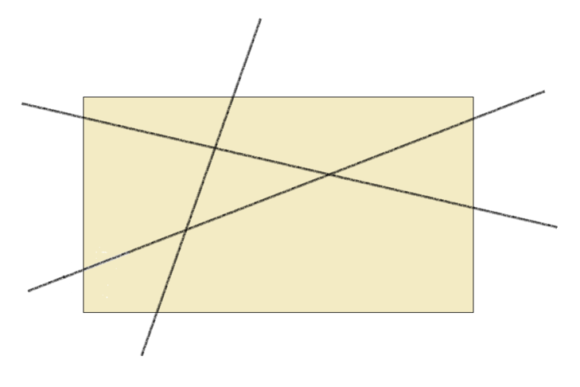

# Week 2: Functions and lists in Erlang

## 2.2: Recursion on integers

Were presented with a recursion example to calculate Factorial:
Factorial of N is the product **1*2*3*...*(N-1)*N** and Factorial of **0** is **1**.

```erlang
-spec factorial(N :: non_neg_integer()) -> pos_integer().
factorial(0) ->
	1;
factorial(N) ->
	factorial(N - 1) * N.
```

Hand Calculation:

```
factorial(3)
= factorial(2)*3
= (factorial(1)*2)*3
= ((factorial(0)*1)*2)*3
= ((1*1)*2)*3
= (1*2)*3
= 2 *3
= 6
```

Somebody in the class pointed to a solution with a guard `factorial(N) when N > 0 ->` since negative numbers never end. Were explained that an option is also to let dialyzer find the negative value using the right spec, this embraces the let it crash motto, code for the happy inputs and forget about covering all the cases. Was pointed to https://ferd.ca/the-zen-of-erlang.html.

Examples let it crash:

```erlang
1> factorial("hey").
** exception error: an error occurred when evaluating an arithmetic expression
     in operator  -/2
        called as "hey" - 1
2> factorial(infinity).
** exception error: an error occurred when evaluating an arithmetic expression
     in operator  -/2
        called as infinity - 1
```

* Other interesting question was how to express the above in the shell which leaded to the following links:

	- https://learnyousomeerlang.com/higher-order-functions (anonymous functions section)
	- https://erlang.org/doc/programming_examples/funs.html
	- https://medium.com/erlang-battleground/having-fun-with-funs-d199a4f522d3

Basically, can be used like `F = fun Fac(0) -> 1; Fac(N) -> Fac(N-1) * N end.`.

* The professor gave some explanation about guards like `factorial(N) when N > 0 ->`:

	- They can contain arithmetical operations and comparisons.
	- Can be combined with **and(,)** and **or(;)**.
	- Can't contain user-defined functions because they should be things that pattern match and terminate.

* The "Let it crash!" principle and the why of it is that is the responsibility of the caller, who called the function with erroneous input, to sort it out ... since the function itself can't predict what the right option is. It's offensive programming rather than deffensive.

* Recursion can be seen as executable specification because it gives a direct description of what it does.

## 2.3  Recursion examples

This chapter is about some recursion excersises to write in Erlang and do the calculations/reasoning by hand:

1. Fibonacci numbers

The Fibonacci sequence is given by 0, 1, 1, 2, 3, 5, … where subsequent values are given by adding the two previous values in the sequence.
Give a recursive definition of the function `fib/1` computing the Fibonacci numbers, and give a step-by-step evaluation of fib(4).

2. How many pieces?

Define a function `pieces` so that `pieces(N)` tells you the maximum number of pieces into which you can cut a piece of paper with N straight line cuts.



If you’d like to take this problem further, think about the 3-dimensional case. Into how many pieces can you cut a wooden block with N saw cuts?
Taking it even further: What is the general problem in n dimensions?


